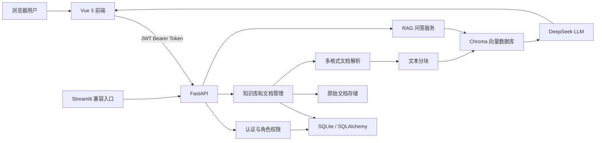

# 企业知识库智能助手

一个面向企业内部文档管理与知识查询的 RAG 应用。项目采用 Vue 3 + FastAPI 前后端分离架构，支持多格式文档解析、Embedding 语义检索、Chroma 向量存储和 DeepSeek 文档问答，并提供 JWT 登录、角色权限、知识库管理和用户管理。

原有 Streamlit `app.py` 继续保留，可作为轻量演示和兼容入口。

## 当前进度

- [x] 多格式文档解析和文本分块
- [x] Chroma 向量检索和来源标注
- [x] DeepSeek 文档问答与友好异常提示
- [x] FastAPI 模块化后端
- [x] SQLite、SQLAlchemy 和 Alembic 迁移
- [x] JWT 登录、管理员和普通用户权限
- [x] 知识库、文档和用户管理接口
- [x] Vue 3 企业管理后台和聊天查询页
- [x] 后端接口测试和 Playwright 端到端测试
- [ ] 用户与知识库细粒度授权
- [ ] 聊天会话持久化和审计日志
- [ ] Vue 与 FastAPI 云端部署

## 功能

### 管理员

- 查看知识库、文档、文本块和用户统计
- 创建和查看知识库
- 上传 PDF、TXT、Markdown、DOCX、CSV、XLSX 文档
- 查看文档处理状态、文件大小、SHA-256 和文本块数量
- 删除文档并同步清理该文档的 Chroma 向量
- 重新解析文档并建立索引
- 创建用户、启用或禁用账号、修改角色、重置密码

### 普通用户

- 登录后查看可查询的知识库列表
- 使用聊天界面进行知识库问答
- 查看回答引用的文档名、页码或行号、相似度和原文片段
- 新建会话或清空当前会话
- 无法访问管理员路由和管理接口

## 技术栈

### 前端

- Vue 3、Vite、TypeScript
- Vue Router、Pinia、Axios
- Element Plus、Lucide Icons
- Playwright

### 后端与 RAG

- FastAPI、Uvicorn
- SQLAlchemy、Alembic、SQLite
- JWT、bcrypt
- Chroma、sentence-transformers
- DeepSeek API（OpenAI 兼容接口）
- pypdf、python-docx、openpyxl
- pytest

## 系统架构



## 项目结构

```text
.
├─ backend/
│  ├─ core/             # 配置和安全工具
│  ├─ dependencies/     # FastAPI 权限依赖
│  ├─ models/           # 用户、知识库和文档模型
│  ├─ routers/          # 登录、管理和问答接口
│  ├─ schemas/          # 请求和响应模型
│  ├─ services/         # 业务逻辑
│  ├─ database.py
│  └─ main.py           # FastAPI 入口
├─ frontend/
│  ├─ src/api/          # Axios API 封装
│  ├─ src/components/   # 通用、知识库和聊天组件
│  ├─ src/layouts/      # 管理后台和查询布局
│  ├─ src/router/       # 路由与权限守卫
│  ├─ src/stores/       # Pinia 登录状态
│  ├─ src/types/        # TypeScript 类型
│  └─ src/views/        # 登录、管理和查询页面
├─ alembic/             # 数据库迁移
├─ tests/               # FastAPI 接口测试
├─ sample_documents/    # 本地测试文档
├─ app.py               # Streamlit 兼容入口
├─ document_loader.py   # 多格式文档解析
├─ text_splitter.py     # 文本分块
├─ vector_store.py      # Embedding 和 Chroma
├─ llm_client.py        # DeepSeek 调用
└─ requirements.txt
```

## 本地运行

### 1. 创建并激活虚拟环境

```powershell
cd pdf-ai-assistant
python -m venv .venv
.\.venv\Scripts\Activate.ps1
python -m pip install -r requirements.txt
```

### 2. 配置环境变量

复制 `.env.example` 为 `.env`，然后填写本地配置。不要将 `.env` 上传到 GitHub。

```env
DEEPSEEK_API_KEY=your_api_key_here
APP_USERNAME=your_admin_username
APP_PASSWORD=your_admin_password
JWT_SECRET_KEY=replace_with_a_long_random_secret
ACCESS_TOKEN_EXPIRE_MINUTES=480
DATABASE_URL=sqlite:///./data/app.db
UPLOAD_STORAGE_DIR=./data/uploads
CORS_ORIGINS=http://localhost:5173,http://127.0.0.1:5173
```

`APP_USERNAME` 和 `APP_PASSWORD` 用于首次启动时创建管理员账号。

### 3. 执行数据库迁移

```powershell
python -m alembic upgrade head
```

### 4. 启动 FastAPI

```powershell
python -m uvicorn backend.main:app --host 127.0.0.1 --port 8000
```

接口文档：<http://127.0.0.1:8000/docs>

如果 8000 端口已被占用，可以改用 8001，同时修改前端的 `VITE_API_BASE_URL`。

### 5. 启动 Vue 前端

复制 `frontend/.env.example` 为 `frontend/.env.local`：

```env
VITE_API_BASE_URL=http://127.0.0.1:8000
```

在第二个终端执行：

```powershell
cd pdf-ai-assistant\frontend
npm install
npm run dev
```

访问：<http://127.0.0.1:5173>

### 6. 可选：启动 Streamlit 兼容版本

```powershell
cd pdf-ai-assistant
python -m streamlit run app.py
```

访问：<http://127.0.0.1:8501>

## 主要路由

| 页面 | 权限 | 用途 |
| --- | --- | --- |
| `/login` | 公开 | 登录 |
| `/admin/dashboard` | 管理员 | 数据概览 |
| `/admin/knowledge-bases` | 管理员 | 知识库列表与创建 |
| `/admin/knowledge-bases/:id` | 管理员 | 文档上传、删除和重新索引 |
| `/admin/users` | 管理员 | 用户管理 |
| `/app/chat` | 已登录用户 | 知识库查询 |
| `/403` | 公开 | 越权提示 |

普通用户知识库目录接口：

```http
GET /api/knowledge-bases
Authorization: Bearer <JWT>
```

当前活跃用户可以读取全部知识库列表，细粒度知识库授权将在后续版本增加。

## 测试与构建

后端测试：

```powershell
python -m pytest -q
```

Vue 正式构建：

```powershell
cd frontend
npm run build
```

Playwright 端到端测试需要先启动 FastAPI 和 Vue，并配置测试管理员环境变量：

```powershell
cd frontend
npx playwright test
```

当前验收结果：后端 7 项测试通过，管理员和普通用户两条 Playwright 业务链路通过。

## 数据与安全

以下内容不会提交到 GitHub：

- `.env`、`frontend/.env.local`
- `.venv/`、`frontend/node_modules/`、`frontend/dist/`
- `data/`、`.chroma_db/`
- Playwright 临时测试结果

生产部署时必须：

- 使用独立的强随机 `JWT_SECRET_KEY`
- 将 DeepSeek API Key 配置为云端密钥
- 配置准确的 `CORS_ORIGINS`
- 将关系数据库迁移到 PostgreSQL
- 为上传文档和 Chroma 配置持久化存储
- 使用 HTTPS，不在日志中记录密码和 Token

## Docker 部署

项目已经提供：

- 根目录 `Dockerfile`：FastAPI、Alembic 和 RAG 运行环境。
- `frontend/Dockerfile`：构建 Vue 并使用 Nginx 提供静态页面。
- `docker-compose.yml`：编排 Web、API 和持久化卷。
- `deploy/nginx/default.conf`：Vue SPA 路由和 FastAPI 反向代理。
- `.env.production.example`：生产环境变量模板。

阿里云 Ubuntu ECS 的完整操作步骤见 [`DEPLOYMENT.md`](DEPLOYMENT.md)。
## 项目定位

该项目已经从单文件 PDF 问答原型升级为包含前端、后端、数据库、权限和文档管理的企业知识库 MVP，可用于展示 RAG 应用开发、FastAPI 工程化和 Vue 前后端分离能力。