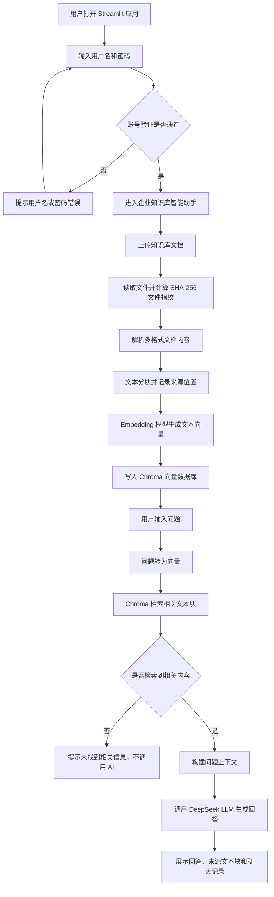

# 企业知识库智能助手

这是一个基于 Streamlit、Embedding、Chroma 向量数据库和 DeepSeek API 的企业知识库问答项目。用户可以同时上传多种格式的文档，系统会解析文档内容、切分文本块、生成向量并写入 Chroma，然后根据用户问题进行语义检索，最后调用 DeepSeek 基于检索结果生成回答。

项目可以作为企业知识库智能助手的 MVP 原型，也适合作为 AI 应用开发、RAG、向量检索方向的简历项目。

## 功能特点

- 支持多文档同时上传
- 支持 PDF、TXT、Markdown、DOCX、CSV、XLSX
- 自动解析不同格式文档内容
- 将文档内容切分为文本块
- 使用 sentence-transformers 生成 Embedding 向量
- 使用 Chroma 持久化存储向量
- 根据用户问题进行向量相似度检索
- 调用 DeepSeek API 生成文档问答结果
- 回答时展示来源文档、页码、段落、行号或表格行号
- 支持聊天记录展示和清空
- 支持用户名和密码登录保护，避免公开链接被随意使用
- 使用 SHA-256 识别当前知识库文件集合
- 未检索到相关内容时不调用 AI，减少无效 token 消耗
- 对 API Key 无效、余额不足、限流、网络失败等情况进行友好提示

## 技术栈

- Python
- Streamlit
- FastAPI
- pypdf
- python-docx
- openpyxl
- sentence-transformers
- Chroma
- DeepSeek API
- OpenAI Python SDK
- python-dotenv
- requests

## 项目结构

```text
pdf-ai-assistant/
├── app.py
├── config.py
├── auth.py
├── document_loader.py
├── text_splitter.py
├── vector_store.py
├── llm_client.py
├── backend/
│   ├── __init__.py
│   └── main.py
├── sample_documents/
├── requirements.txt
├── README.md
├── PROJECT_PROGRESS.md
├── .env.example
└── .gitignore
```

说明：

- `app.py`：Streamlit 页面入口，负责上传、提问、结果展示和聊天记录
- `config.py`：项目配置项，例如分块大小、模型名称、支持文件类型
- `auth.py`：用户名和密码登录模块，支持从环境变量或 Streamlit Secrets 读取账号配置
- `document_loader.py`：文档解析模块，负责 PDF、TXT、Markdown、DOCX、CSV、XLSX 文本提取
- `text_splitter.py`：文本分块和来源位置格式化模块
- `vector_store.py`：Embedding 模型加载、Chroma 入库和向量检索模块
- `llm_client.py`：DeepSeek API 调用和提示词上下文构建模块
- `backend/main.py`：FastAPI 后端入口，提供登录、文档上传、知识库问答等接口
- `sample_documents/`：本地测试用示例文档
- `requirements.txt`：项目依赖列表
- `README.md`：项目说明文档
- `PROJECT_PROGRESS.md`：学习和开发进度记录
- `.env.example`：环境变量示例文件，不存放真实 API Key
- `.gitignore`：Git 忽略规则，避免上传 `.env`、虚拟环境和本地向量库

本地运行后会生成 `.chroma_db/`，这是 Chroma 的本地向量数据库目录，不应该上传到 GitHub。

## 环境准备

建议使用 Python 3.10 或更高版本。

创建并激活虚拟环境：

```powershell
python -m venv .venv
.\.venv\Scripts\Activate.ps1
```

安装依赖：

```powershell
pip install -r requirements.txt
```

## 配置 API Key

在项目根目录创建 `.env` 文件，并填写 DeepSeek API Key：

```env
DEEPSEEK_API_KEY=你的 DeepSeek API Key
APP_USERNAME=你的访问用户名
APP_PASSWORD=你的访问密码
```

注意：`.env` 文件包含敏感信息，不要上传到 GitHub。

可以创建 `.env.example` 作为示例：

```env
DEEPSEEK_API_KEY=your_api_key_here
APP_USERNAME=your_demo_username_here
APP_PASSWORD=your_demo_password_here
FASTAPI_BASE_URL=http://localhost:8000
```

如果部署到 Streamlit Community Cloud，需要在应用的 Secrets 中配置：

```toml
DEEPSEEK_API_KEY = "你的 DeepSeek API Key"
APP_USERNAME = "你的访问用户名"
APP_PASSWORD = "你的访问密码"
```

## 运行项目

### 运行 Streamlit 版本

在项目根目录执行：

```powershell
python -m streamlit run app.py
```

运行成功后，浏览器会打开：

```text
http://localhost:8501
```

### 运行 FastAPI 后端版本

在项目根目录执行：

```powershell
python -m uvicorn backend.main:app --reload --port 8000
```

运行成功后，可以打开接口文档：

```text
http://localhost:8000/docs
```

当前 FastAPI 后端已提供：

```text
GET /health       健康检查
POST /login       用户名密码登录，返回 access_token
POST /upload      上传文档并构建 Chroma 知识库
POST /ask         基于指定知识库提问
```

## 系统流程图



## 使用流程

1. 上传一个或多个知识库文档
2. 等待系统解析文档并写入 Chroma 向量数据库
3. 在输入框中输入问题
4. 点击“提交问题”
5. 查看 AI 回答和检索到的来源文本块

## 当前版本说明

当前版本已经从单 PDF 问答助手升级为多文档企业知识库智能助手 MVP。

当前支持的知识库流程：

```text
多文档上传
-> 文档解析
-> 文本分块
-> Embedding 向量化
-> Chroma 向量入库
-> 问题向量检索
-> DeepSeek 生成回答
-> 来源文档展示
```

PDF 页码和行号基于提取后的文本计算，可能与复杂排版中的视觉行号略有差异。扫描版 PDF 暂时需要后续加入 OCR。

## 后续优化方向

- 增加 OCR，支持扫描版 PDF
- 增加文档删除和重新构建索引功能
- 支持知识库历史持久化管理
- 支持多知识库切换
- 增加用户登录和权限控制
- 部署到 Streamlit Community Cloud 或云服务器
- 后续重构为 FastAPI + React 前后端分离架构

## 简历描述参考

企业知识库智能助手：基于 Python、Streamlit、Chroma、sentence-transformers 和 DeepSeek API 开发的多文档 RAG 问答应用，支持 PDF、TXT、Markdown、DOCX、CSV、XLSX 等多种文档格式，实现文档解析、文本分块、Embedding 向量化、Chroma 向量检索、来源标注、聊天记录和 API 异常处理，完成企业知识库智能助手 MVP。
